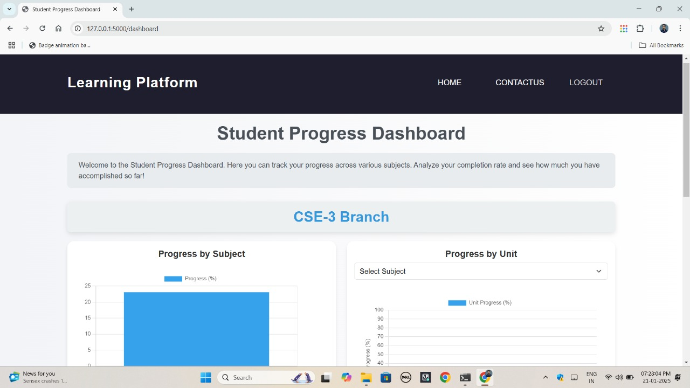

# ProLearn Connect

**ProLearn Connect** is an interactive and user-friendly learning platform designed to streamline the educational journey for students preparing for **AKTU college exams**, **GATE exams**, and enhancing their skills in **programming languages**. The platform provides curated resources, engaging visualizations, and a comprehensive dashboard to track progress and foster continuous learning.

## Key Features

### 1. Curated Video Resources
- The platform hosts the best YouTube videos for:
  - AKTU syllabus
  - GATE preparation
  - Programming languages

### 2. Interactive Dashboard
- Time score chart to visualize learning progress.
- Section-wise progress for various branches:
  - Electronics and Communication (EC)
  - Electrical Engineering (EE)
  - Mechanical Engineering (ME)

### 3. Alumni Community
- Engage with alumni through dedicated profiles.
- Alumni contact details included on profile photos.

### 4. Course Customization
- Select courses based on specific learning needs.
- Feedback mechanism to improve course offerings.

## Technology Stack
- **Frontend:** HTML, CSS, JavaScript, Bootstrap
- **Backend:** Flask
- **Database:** Excel, SQLite

## Future Enhancements
- Addition of more branches and courses.
- Enhanced interactivity for the dashboard and visualizers.
## Sample

Here is a sample preview of **ProLearn Connect** in action:

### Dashboard Screenshot

